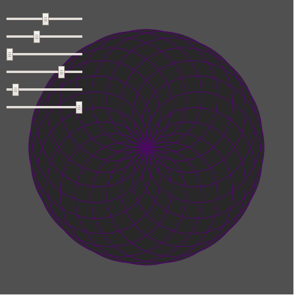

Mathematical rose patterns is a design plotted in polar coordinates

Changes made to rose pattern design, attempted to make sliders that change size of design (not working), made sliders that change the color of design, changed values of d and n, added new sliders, changed position of sliders, changed background color, made more possible shapes/designs.

//declaring variables

//sliderZ is an attempt to make a slider that changes the size of the pattern (not working)
let d = 8, n = 5, z = 2, sliderD, sliderN, sliderZ, SliderR, SliderG, SliderB;
function setup() {
  createCanvas(500, 500);
	//making sliders
  sliderD = createSlider(1,100,50);
	sliderD.position(10,20);
	sliderN = createSlider(1,100,50);
	sliderN.position(10,50);
	sliderZ = createSlider(1,10,1);
	sliderZ.position(10,80);
  sliderR = createSlider(1,100,50);
	sliderR.position(10,110);
	sliderG = createSlider(1,100,50);
	sliderG.position(10,140);
	sliderB = createSlider(1,100,50);
	sliderB.position(10,170);
}

function draw() {
  //sliders that change the the colour of the design
  let R = sliderR.value();
  let G = sliderG.value();
  let B = sliderB.value();
	d = sliderD.value();
	n = sliderN.value();
	//calculating k
  var k = n/d;
  background(80);
	translate(width/ 2, height / 2);
	//programming desgin
  beginShape();
	stroke(R, G, B);
	fill(40);
	strokeWeight(0.5);
  //making a loop that gives an angle which is used in equations to calculate radius and coordinates
	for (var a = 0; a < TWO_PI * d; a += 0.02) {
		var r = 200 * cos(k * a);
		var x = r * cos(a);
		var y = r * sin(a);
		vertex(x,y);
	}
endShape(CLOSE);
}
